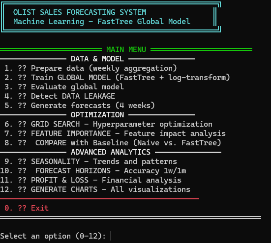
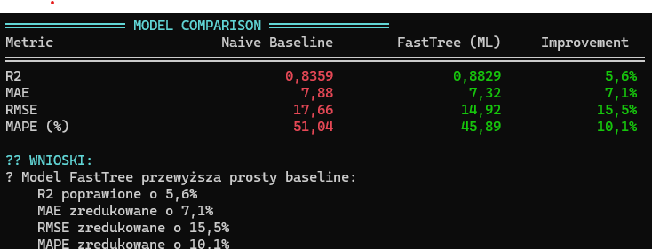

# Olist Sales Forecasting

A high-performance machine learning project for weekly sales prediction within the Brazilian e-commerce ecosystem (Olist dataset). This project utilizes **ML.NET FastTree** to forecast item sales per product category, prioritizing production-grade stability and .NET native integration.

---

## Results

### Why This Split?

The Olist dataset spans **September 2016 to August 2018**, but early months (Sep 2016 - Dec 2016) were excluded from training due to:

1. **Data sparsity** - Only a few orders per week in the platform's early days
2. **High noise** - Sales patterns were unstable during initial platform growth
3. **Insufficient lag features** - Need at least 4 weeks of history for `Lag1-4` features
4. **Cold start effect** - Categories had incomplete weekly coverage

Starting from **January 2017** ensures:
- Stable weekly order volume (50+ orders/week across categories)
- Reliable lag features and rolling averages
- Minimum 12 weeks of data per category (required for seasonality calculation)

The **1-week gap** between training (ends Feb 19) and testing (starts Feb 26) prevents data leakage - the model cannot "see" test set values when computing lag features.

### FastTree vs Naive Baseline

| Metric | Naive Baseline | FastTree (ML) | Improvement |
|--------|----------------|---------------|-------------|
| R²     | 0.8359         | 0.8829        | +5.6%       |
| MAE    | 7.88           | 7.32          | -7.1%       |
| RMSE   | 17.66          | 14.92         | -15.5%      |
| MAPE   | 51.04%         | 45.89%        | -10.1%      |

---

### Why FastTree (ML.NET)?
For this implementation, FastTre* was selected over LightGBM or Python-based alternatives for two primary reasons:

Type Safety & Integration: Being native to ML.NET, it utilizes C# strongly-typed schemas. This ensures data integrity from the database to the model, catching potential errors at compile-time rather than at runtime.
Execution Speed (Small to Mid-sized Data): FastTree eliminates the "interop overhead" typically found when calling C++ libraries (like LightGBM) from managed code. For this dataset size, it resulted in significantly faster training cycles (~4s).

### Where Python and LightGBM have the advantage
While ML.NET is excellent for production stability, Python and the standalone LightGBM library excel in specific scenarios:

Large-Scale Data & Scalability: When working with massive datasets (millions of rows), LightGBM’s highly optimized algorithms (like GOSS and EFB) allow it to scale more efficiently. Once "up to speed," LightGBM often outperforms FastTree on high-volume training tasks.
Memory & VRAM Management: LightGBM is world-class at managing memory. It offers superior VRAM (GPU) utilization, making it the preferred choice for extremely large models where hardware acceleration and memory footprint are critical.
Advanced Research: The Python ecosystem (Pandas, Optuna, PyTorch) remains the gold standard for rapid prototyping, complex feature engineering, and state-of-the-art Deep Learning.n Speed:** FastTree eliminates the "interop overhead" typically found when calling C++ libraries (like LightGBM) from managed code. This resulted in significantly faster training cycles (~4s) and a highly responsive prediction engine.

---
	
## C# vs Python for ML

This project demonstrates the viability of **C#** for end-to-end Machine Learning pipelines.

### Why C#?

|                       | C# / .NET                                    | Python                                  |
|-----------------------|----------------------------------------------|-----------------------------------------|
| **Type Safety**       | Compile-time schema validation               | Runtime errors                          |
| **Deployment**        | Windows Service, Azure Function, Docker      | Requires Python runtime                 |
| **Data Processing**   | LINQ/PLINQ (fast, parallel)                  | Pandas (flexible, slower)               |
| **Stack Integration** | Same language for API + ML                   | Often needs Flask/FastAPI bridge        |
| **Ecosystem**         | Smaller ML community                         | Huge (scikit-learn, PyTorch, etc.)      |
| **Prototyping**       | Slower (compile cycle)                       | Fast (Jupyter notebooks)                |

---

## Features & Engineering

The model processes the following features to capture temporal trends and seasonality:

| Feature                 | Type        | Description                                |
|-------------------------|-------------|--------------------------------------------|
| `Lag1` - `Lag4`         | Numerical   | Sales volume from previous 1-4 weeks       |
| `RollingAvg4Weeks`      | Numerical   | 4-week moving average to reduce noise      |
| `WeekNumber`            | Categorical | ISO week of year (1-52)                    |
| `Month`                 | Categorical | Month (1-12)                               |
| `Quarter`               | Categorical | Quarter (1-4)                              |
| `IsBlackFridayWeek`     | Boolean     | Brazilian Black Friday flag                |
| `IsHolidaySeason`       | Boolean     | November-December peak period              |
| `CategoryHistoricalAvg` | Numerical   | Monthly seasonality per category           |
| `ProductCategory`       | One-Hot     | 73 product categories encoded              |

---

## Project Structure & Output

All trained models and evaluation reports are saved to the `models/` directory:

| File                       | Description                                      |
|----------------------------|--------------------------------------------------|
| `global_model.zip`         | Serialized FastTree model ready for inference    |
| `global_metrics.json`      | Performance metrics (R², MAE, RMSE, MAPE)        |
| `feature_importance.json`  | Permutation Feature Importance (PFI) rankings    |
| `baseline_comparison.json` | FastTree vs Naive baseline comparison            |
| `charts/*.png`             | Visualized forecast vs actual sales              |

---

## Download the Olist Dataset

Put the following files into `data/` before running the app:
- [olist_orders_dataset.csv](https://www.kaggle.com/datasets/olistbr/brazilian-ecommerce)
- [olist_order_items_dataset.csv](https://www.kaggle.com/datasets/olistbr/brazilian-ecommerce)
- [olist_products_dataset.csv](https://www.kaggle.com/datasets/olistbr/brazilian-ecommerce)
- [product_category_name_translation.csv](https://www.kaggle.com/datasets/olistbr/brazilian-ecommerce)

Run `dotnet run` after populating `data/`.

**Currency:** All monetary values in **Brazilian Real (R$)**

---

## License

MIT
